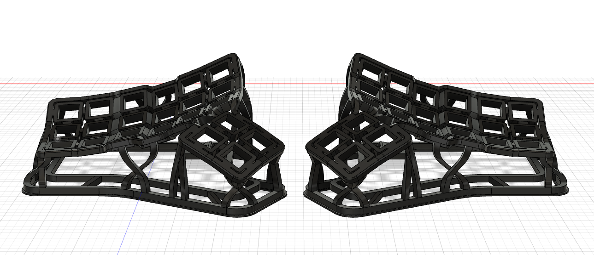
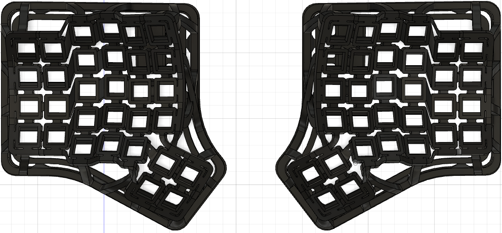

# openwork keyboard

该项目为分体曲面键盘，适合个人diy,所有相关文件都已开源，镂空的46和36配列是不需要螺丝的，因为没有底壳去固定。
pcb使用的是单个，然后行和列去连接。主控固定部分需要用到热熔胶。由于46和36镂空版本只打印了一个版本且已经卖出去了，所有没有实物图片去分享。

# 固件地址
- [zmk固件](https://github.com/LXF-YZP/openwork46)
固件后续会支持zmk studio(现在没有时间写可以参考我之前写的帖子自己进行修改)
https://www.zfrontier.com/app/flow/kMoko8PVORwP

## 元器件清单

|名称       |   数量    |购买链接                                          |
| --------------------------------- | ------ | ------------------------------------------------------------------------------------------ |
| 电池开关小板子       |   2    | https://www.jlc.com/newOrder/#/pcb/pcbPlaceOrder                                          |
| 锂电池                     | 2     | https://item.taobao.com/item.htm?_u=j1hre4eh2cde&id=678474541123&spm=a1z09.2.0.0.3b772e8dD6xWcA                                                                                           |
| nice nano v2                | 2    | https://item.taobao.com/item.htm?_u=j1hre4eha9fa&id=729260528560&spm=a1z09.2.0.0.10f62e8dhW3Jef                                                                                   |
| 螺柱 m2x4x3.5| 10        |https://item.taobao.com/item.htm?_u=j1hre4eh3211&id=556665146796&spm=a1z09.2.0.0.1f7a2e8doqIgMF      |
| 螺丝   m2x5                | 10      |https://detail.tmall.com/item.htm?_u=j1hre4eh4b5e&id=681802232201&spm=a1z09.2.0.0.1f7a2e8doqIgMF  |
|  二极管          | 100     | https://item.taobao.com/item.htm?spm=a1z09.2.0.0.70352e8dhrJ7E7&id=528155613240&_u=q1hre4eh412c                                                                        |
|  按键开关          | 2     | https://item.taobao.com/item.htm?spm=a1z09.2.0.0.70352e8dhrJ7E7&id=546724645617&_u=q1hre4eh5b12                                                                        |
|  卧贴连接器          | 2     | https://item.taobao.com/item.htm?spm=a1z09.2.0.0.70352e8dhrJ7E7&id=565715285795&_u=q1hre4eh267c                                                                        |
|  拨动开关          | 2     | https://item.taobao.com/item.htm?spm=a1z09.2.0.0.70352e8dhrJ7E7&id=557092773462&_u=q1hre4eh5b2e                                                                        |
|  超薄卧贴端子          | 2     | https://item.taobao.com/item.htm?spm=a1z09.2.0.0.67002e8dcmPRUr&id=671868863106&_u=q1hre4eh5865                                                                        |
|  连接线          | 100     | https://item.taobao.com/item.htm?_u=j1hre4eh96c2&id=544239752560&spm=a1z09.2.0.0.31922e8dRDrXVY&skuId=4924186663213_u=q1hre4eh5865                                                                        |

上面有些元器件数量是100，因为最少购买数量是100.

## 外壳打印
- 镂空的外壳没有自己打印过，但是在未来工厂打印过。其他的外壳在A1和A1mini上打印过。

- 在未来工厂进行下单打印。

- 在三维猴进行下单打印。

- 在客制化群里面花钱请群友进行代打或者咸鱼花钱请代打。

# 构建指南

_具体构建指南请参考B站视频讲解_ (现在还未开始)

